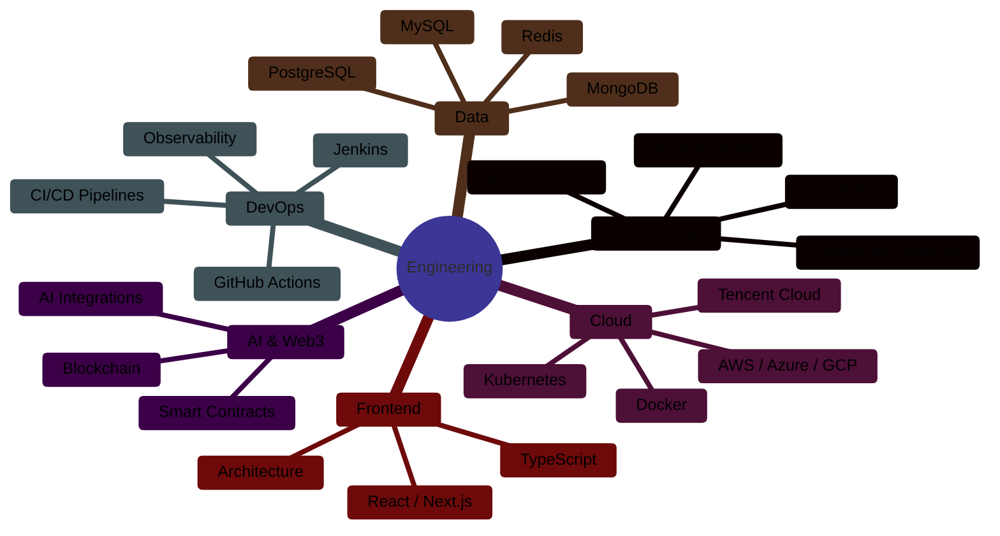

<div align="center">
  
</div>

<br/>

---

## <picture><source media="(preference-color-scheme: dark)" srcset="https://raw.githubusercontent.com/Tarikul-Islam-Anik/Animated-Fluent-Emojis/master/Emojis/Objects/Globe%20with%20Meridians.png"></picture> Profile

I architect and build **distributed systems** engineered for production at scale. With over **8 years** of experience spanning **Full-Stack Engineering**, **Cloud Architecture**, **DevOps**, and **Engineering Leadership**, I specialize in designing multi-tenant SaaS platforms, OTT streaming infrastructure, and AI-integrated systems.

Every system I build is designed with **observability**, **resilience**, and **operational excellence** as first-class concerns — not afterthoughts.

<br/>

### Core Competencies



<br/>

---

## 🛠️ Technology Stack

<div align="center">

### Frontend Engineering


### Backend Engineering


### Cloud & Infrastructure


### CI/CD & Automation


### Databases


### Monitoring & Security


</div>

<br/>

---

## System Design & Architecture

Production-grade distributed systems using domain-driven design and event sourcing. Implemented transactional outbox patterns for data consistency across 12+ microservices. Architected API gateways handling 15K RPS with circuit breakers and rate limiting.

## Cloud Native & DevOps

AWS-certified solutions architect with production experience in EKS, Fargate, and Lambda. Built CI/CD pipelines processing 500+ weekly deployments using GitHub Actions. Implemented service mesh (Istio) for mTLS and traffic management across hybrid environments.

## Platform Engineering

Developed internal developer platform (IDP) reducing service onboarding time from 2 weeks to 4 hours. Created standardized deployment templates enforcing security policies and observability requirements. Integrated with ArgoCD for GitOps workflows.

<br/>

## Selected Production Systems

- **[system-design-blueprints](https://github.com/ahbilalkhan/system-design-blueprints)**  
  Architecture decision records and scalability patterns for high-throughput systems

- **[cloud-native-patterns](https://github.com/ahbilalkhan/cloud-native-patterns)**  
  Production-tested implementations of circuit breakers, retries, and bulkheads

- **[github-actions-workflows](https://github.com/ahbilalkhan/github-actions-workflows)**  
  Enterprise-grade CI/CD templates with security scanning and approval gates

- **[fastapi-enterprise-starter](https://github.com/ahbilalkhan/fastapi-enterprise-starter)**  
  Production-ready Python template with OpenTelemetry and JWT validation

- **[kubernetes-deployment-patterns](https://github.com/ahbilalkhan/kubernetes-deployment-patterns)**  
  Zero-downtime deployment strategies for stateful services

- **[distributed-systems-lab](https://github.com/ahbilalkhan/distributed-systems-lab)**  
  Research on consensus algorithms and distributed transaction patterns

<br/>

---

[](https://github.com/ahbilalkhan)
[](https://github.com/ahbilalkhan)

<br/>

---


<br/>

---


---


<br/>

---


<br/>

---


<br/>

---

<div align="center">

```
⚡ Production-grade systems. Enterprise architecture. Engineering leadership.
```

<br/>

<sub>_This profile is optimized for dark mode. If you're viewing in light mode, consider switching._</sub>

<br/>
<br/>


<br/>


</div>