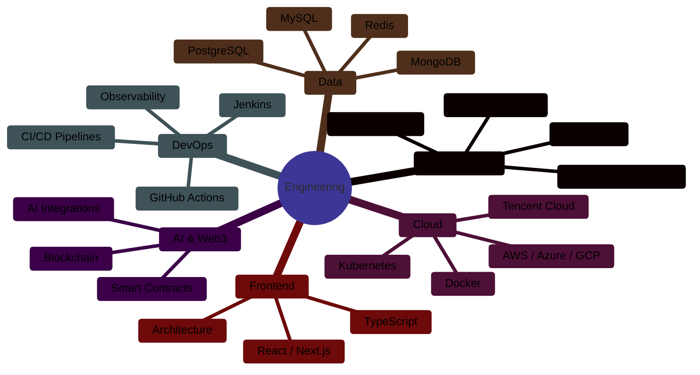
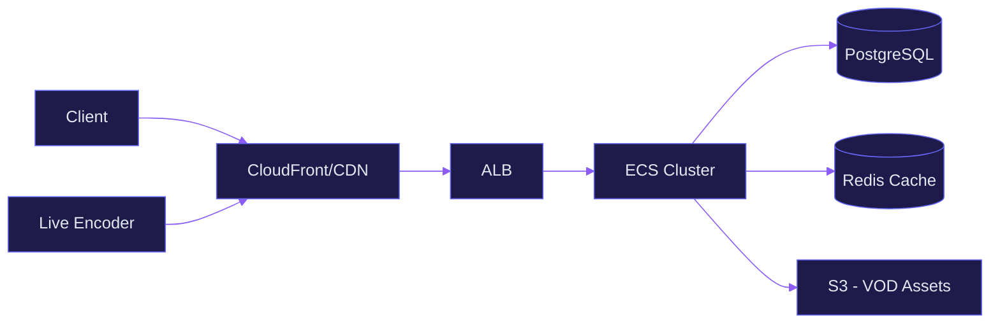
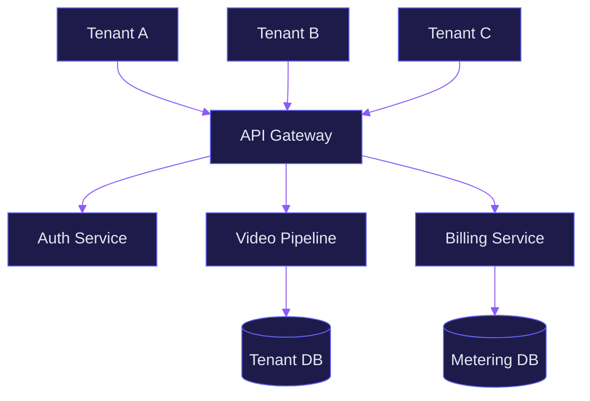
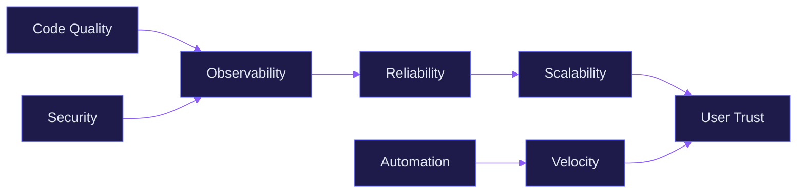

<div align="center">

```svg
<svg xmlns="http://www.w3.org/2000/svg" width="900" height="220" viewBox="0 0 900 220">
  <defs>
    <linearGradient id="g1" x1="0%" y1="0%" x2="100%" y2="0%">
      <stop offset="0%" style="stop-color:#6366f1;stop-opacity:1" />
      <stop offset="50%" style="stop-color:#8b5cf6;stop-opacity:1" />
      <stop offset="100%" style="stop-color:#6366f1;stop-opacity:1" />
    </linearGradient>
    <linearGradient id="g2" x1="0%" y1="0%" x2="100%" y2="100%">
      <stop offset="0%" style="stop-color:#1e1b4b;stop-opacity:1" />
      <stop offset="100%" style="stop-color:#0f172a;stop-opacity:1" />
    </linearGradient>
  </defs>
  <rect width="900" height="220" rx="16" fill="url(#g2)"/>
  <text x="450" y="85" font-family="system-ui, -apple-system, sans-serif" font-size="48" font-weight="700" fill="url(#g1)" text-anchor="middle" letter-spacing="2">Ahmed Bilal Khan</text>
  <text x="450" y="130" font-family="system-ui, -apple-system, sans-serif" font-size="20" font-weight="400" fill="#94a3b8" text-anchor="middle" letter-spacing="4">LEAD SOFTWARE ENGINEER</text>
  <text x="450" y="165" font-family="system-ui, -apple-system, sans-serif" font-size="14" fill="#64748b" text-anchor="middle" letter-spacing="1">Karachi, Pakistan · Enterprise Architecture · Platform Engineering</text>
  <line x1="300" y1="185" x2="600" y2="185" stroke="#334155" stroke-width="1" opacity="0.6"/>
  <text x="450" y="205" font-family="system-ui, -apple-system, sans-serif" font-size="13" fill="#475569" text-anchor="middle" letter-spacing="3">FULL-STACK | CLOUD | DEVOPS | AI | WEB3</text>
</svg>
```

<br/>

[](mailto:ahmed.bilal@email.com)
[](https://linkedin.com/in/ahbilalkhan)
[](https://github.com/ahbilalkhan)
[](https://medium.com/@ahbilalkhan)
[](https://stackoverflow.com/users/ahbilalkhan)

<br/>

<!-- Typing Animation -->
<a href="https://git.io/typing-svg"></a>

</div>

<br/>

---

## <picture><source media="(preference-color-scheme: dark)" srcset="https://raw.githubusercontent.com/Tarikul-Islam-Anik/Animated-Fluent-Emojis/master/Emojis/Objects/Globe%20with%20Meridians.png"></picture> Profile

I architect and build **distributed systems** engineered for production at scale. With over **8 years** of experience spanning **Full-Stack Engineering**, **Cloud Architecture**, **DevOps**, and **Engineering Leadership**, I specialize in designing multi-tenant SaaS platforms, OTT streaming infrastructure, and AI-integrated systems.

Every system I build is designed with **observability**, **resilience**, and **operational excellence** as first-class concerns — not afterthoughts.

<br/>

### Core Competencies



<br/>

---

## 🛠️ Technology Stack

<div align="center">

### Frontend Engineering


### Backend Engineering


### Cloud & Infrastructure


### CI/CD & Automation


### Databases


### Monitoring & Security


</div>

<br/>

---

## 📦 Architecture & Platform Work

<table>
<tr>
<td width="50%">

### OTT Streaming Platform
**ARY PLUS**

Scaled for **5M+ concurrent users** with live streaming and VOD delivery. Designed CDN architecture, multi-region failover, and adaptive bitrate streaming pipeline.



</td>
<td width="50%">

### Multi-Tenant VPaaS Platform
**VODISTRY**

Built from the ground up — a **Video Platform as a Service** with tenant isolation, usage-based billing, and white-label streaming infrastructure.



</td>
</tr>
</table>

<br/>

<details>
<summary><b>📁 View All Projects</b></summary>
<br/>

<table>
<tr>
<td width="33%">

### 🤖 Shaed.ai
AI-powered commercial fleet digitization platform. Combines computer vision, telemetry processing, and predictive analytics for fleet management at enterprise scale.

</td>
<td width="33%">

### 💳 Titanium Payments
Secure payment processing infrastructure with PCI-compliant architecture, tokenization, and multi-provider routing for high-throughput transaction processing.

</td>
<td width="33%">

### 🤲 LaunchGood
Microservice-based fundraising platform. Designed event-sourced architecture with idempotent payment workflows supporting global campaign processing.

</td>
</tr>
<tr>
<td width="33%">

### 🏠 Mosaik
Real estate marketplace platform with property listing management, search indexing, and multi-tier user roles with role-based access controls.

</td>
<td width="50%" colspan="2" align="center">

### 📐 System Architecture Design Patterns

| Pattern | Applied In |
|---------|-----------|
| Event Sourcing | LaunchGood |
| CQRS | Titanium Payments |
| Saga Orchestration | VODISTRY Billing |
| Strangler Fig | ARY PLUS Migration |
| Bulkhead Isolation | Shaed.ai Processing |
| Circuit Breaker | Multi-provider Routing |

</td>
</tr>
</table>
</details>

<br/>

---

## 📈 GitHub Analytics

<div align="center">

[](https://github.com/ahbilalkhan)

<br/>

[](https://github.com/ahbilalkhan)

</div>

<br/>

---

## 🌊 Contribution Activity

<div align="center">

[](https://git.io/streak-stats)

<br/>


</div>

<br/>

---

## 🧠 Engineering Philosophy



<br/>

> Systems should be **observable by default**, **secure by design**, and **scalable by architecture** — not by accident.

<br/>

---

## 📝 Pinned Repositories

<div align="center">

[](https://github.com/ahbilalkhan/ary-plus-platform)
[](https://github.com/ahbilalkhan/voddistr-vpaas)
[](https://github.com/ahbilalkhan/shaed-ai-platform)
[](https://github.com/ahbilalkhan/titanium-payments)

</div>

<br/>

---

## 📘 Writing & Publications

<div align="center">

[](https://medium.com/@ahbilalkhan)
[](https://medium.com/@ahbilalkhan)
[](https://medium.com/@ahbilalkhan)
[](https://medium.com/@ahbilalkhan)

</div>

<br/>

---

## 🤝 Let's Connect

<div align="center">

I'm currently open to **engineering leadership roles**, **platform architecture consulting**, and **technical advisory** for early-stage and growth-stage companies.

<br/>

[](mailto:ahmed.bilal@email.com)
[](https://linkedin.com/in/ahbilalkhan)
[](https://github.com/ahbilalkhan)
[](https://medium.com/@ahbilalkhan)
[](https://calendly.com/ahbilalkhan)
[](https://dev.to/ahbilalkhan)

</div>

<br/>

---

<div align="center">

```
⚡ Production-grade systems. Enterprise architecture. Engineering leadership.
```

<br/>

<sub>_This profile is optimized for dark mode. If you're viewing in light mode, consider switching._</sub>

<br/>
<br/>


<br/>


</div>